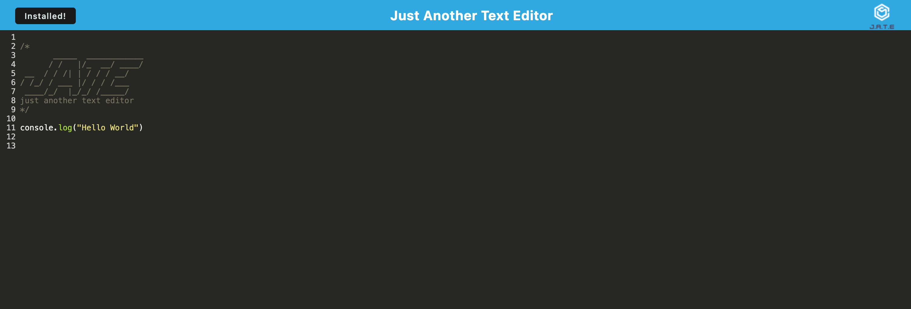
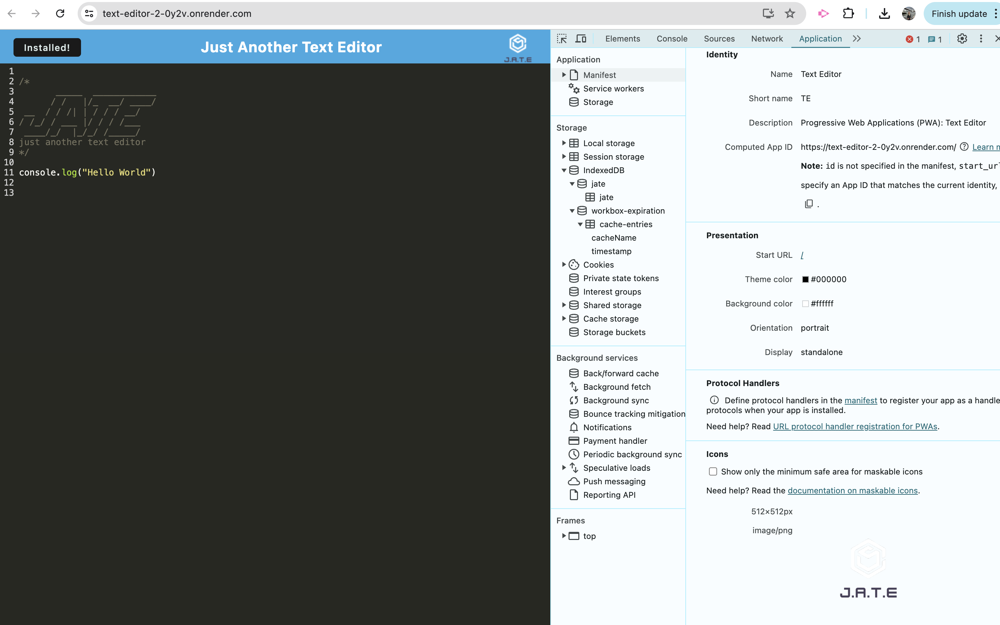
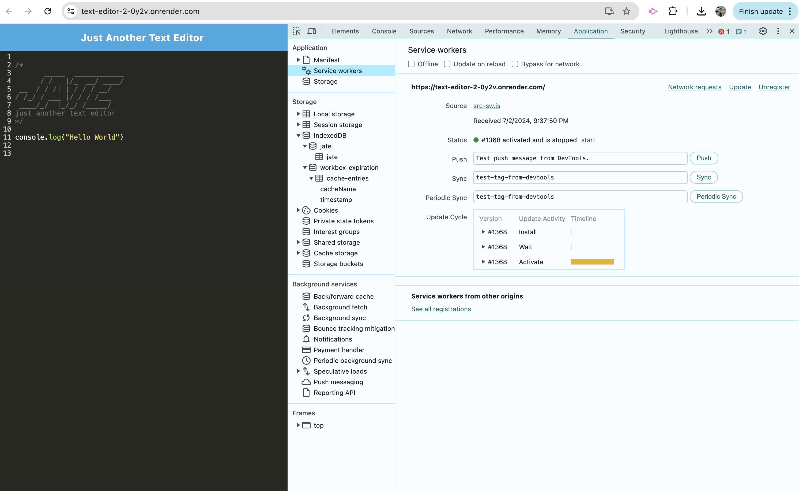
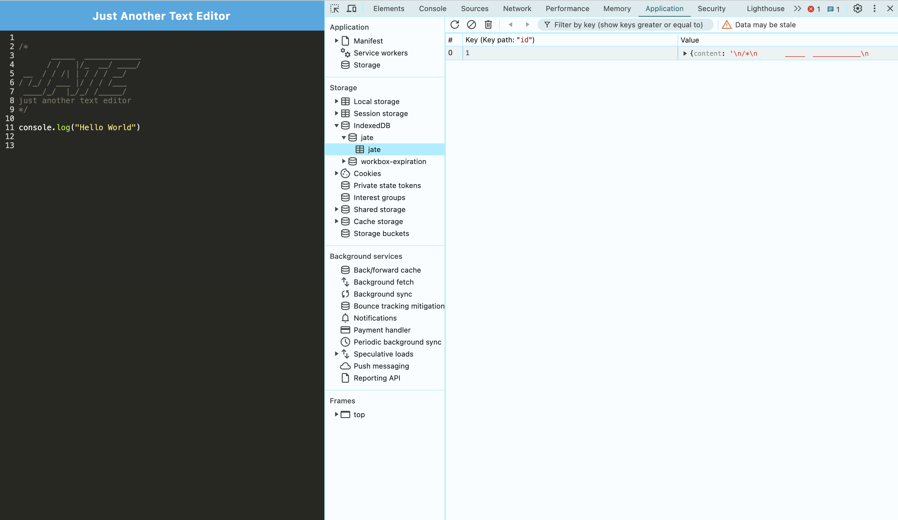

# text-editor
This web-site is a Text Editor

## Description

The app is a single-page application that meets the PWA criteria. The application also function offline.
The starter code has been received.

## Installation
1. Open app in browser.
2. Press install button.

## Usage

1. Open:
2. Press install button.
3. Type any notes, ypu can reach them with or without an internet connection.

## Technologies Used
- HTML
- CSS
- JavaScript
- Node.js

## Mock-Up
The following images show the wed-site appearance and functionality:

